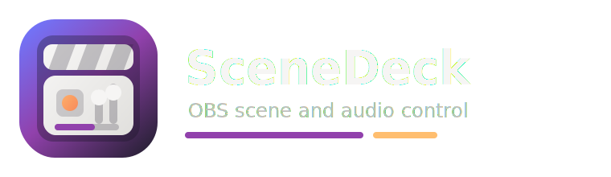

# SceneDeck



SceneDeck is a Linux desktop controller for OBS Studio. It is built with Rust,
GTK4, libadwaita, Tokio, and the OBS WebSocket protocol.

The app is focused on fast live operation: switch OBS scenes, control scene
audio, start or stop streaming and recording, inspect scene dependencies, and
keep local metadata about how scenes are used.

## Current Capabilities

- Connect to OBS Studio through the built-in OBS WebSocket server.
- Switch OBS profiles and scene collections from the header once connected.
- Display the active OBS program scene.
- Show live-switchable scene cards for scenes marked as `Primary`.
- Switch program scenes from the Live page.
- Display global audio sources first, then audio-capable inputs from the active
  scene, including nested scenes and groups.
- Mute or unmute audio inputs.
- Control input volume with compact inverted vertical sliders.
- Lock an audio card slider locally to prevent accidental UI changes.
- Display and control streaming and recording state.
- Assign local scene roles in Inventory.
- Export and import the local scene registry as YAML from Inventory.
- Show nested scene dependencies in Graph.
- Run Doctor diagnostics over scene roles and scene dependency structure.
- Store OBS host and port in the config file and the OBS password in the system
  Secret Service keyring.
- Follow the system color scheme or force light/dark mode.

## Requirements

- Linux desktop with GTK4 and libadwaita runtime libraries.
- OBS Studio with WebSocket enabled.
- Rust stable toolchain for development builds.
- `glib-compile-resources`, usually provided by GLib development packages.
- Secret Service compatible keyring for storing OBS passwords.

OBS Studio 28 and newer includes the WebSocket server. The default SceneDeck
connection target is `127.0.0.1:4455`.

## Quick Start

```sh
cargo run
```

In OBS, enable the WebSocket server and confirm the port and password. In
SceneDeck, open Settings, set the OBS host, port, and optional password, then
use the Connect control at the bottom of the sidebar.

The Live page stays in a disconnected view until OBS is connected. Profile and
scene collection selectors appear in the header only after SceneDeck receives
those lists from OBS.

## Using SceneDeck

Use the sidebar to move between the app views:

- Live: switch Primary scenes, control active scene audio, and control stream
  and record outputs.
- Graph: inspect nested scene dependencies.
- Inventory: assign local roles to OBS scenes.
- Doctor: run structural checks over scenes, roles, and dependencies.
- Settings: configure appearance and OBS connection settings.

SceneDeck does not require you to rename or restructure OBS scenes. The app
keeps its own local registry for role metadata, then uses that registry to
decide which scenes are shown as Live page cards and how scene dependencies are
classified.

## User Guide

See [docs/user-guide.md](docs/user-guide.md) for setup, page-by-page usage,
scene roles, audio behavior, and troubleshooting.

## Developer Guide

Start with [docs/developer-guide.md](docs/developer-guide.md). More detailed
developer docs are available in:

- [docs/architecture.md](docs/architecture.md)
- [docs/codebase-overview.md](docs/codebase-overview.md)
- [docs/obs-websocket.md](docs/obs-websocket.md)
- [docs/configuration.md](docs/configuration.md)
- [packaging/flatpak/README.md](packaging/flatpak/README.md)

The core development rule is to keep protocol access, orchestration, domain
rules, storage, and GTK widgets in their existing boundaries. OBS calls belong
in `src/obs/`, async command routing belongs in `src/controller/`, pure app
concepts belong in `src/domain/` and `src/services/`, persisted files belong in
`src/storage/`, and widgets belong in `src/ui/`.

## Validation

Use these checks before committing changes:

```sh
cargo fmt --all -- --check
cargo check --workspace --all-features
cargo test --workspace --all-features
cargo clippy --workspace --all-targets --all-features -- -D warnings
```

## License

MIT
